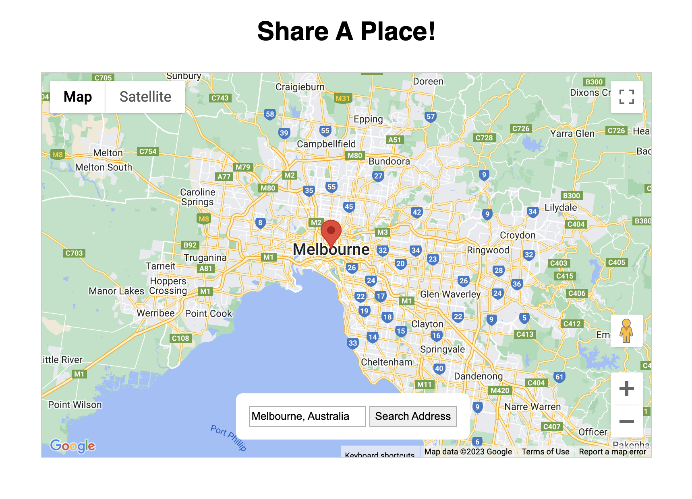

# Share a Place Typescript

This app allows you to search for a place and share it with others. It uses the Google Maps API to get coordinates from an address and then renders a map with a marker on it. It uses a serverless function to get the coordinates from the address.

This was a practice project for learning Typescript. It was made by following [this tutorial](https://www.udemy.com/course/understanding-typescript/learn/lecture/16935782#content) on Udemy

## Tech Stack

## Features

- Search for a place!
- Find that place!

## Screenshot

## Key Concepts

Geocoding - "the process of converting addresses (like "1600 Amphitheatre Parkway, Mountain View, CA") into geographic coordinates (like latitude 37.423021 and longitude -122.083739), which you can use to place markers on a map, or position the map." -[Google](https://developers.google.com/maps/documentation/geocoding/overview)

## Lessons Learned

- How to use the Google Maps API to get coordinates from an address (Geocoding)
- How to Google Maps API to render a map with a marker on it
- How to use @types packages to get 3rd party libraries to work with Typescript
- How to use Webpack to bundle Typescript code
- How to use the Netlify cli
- How to create a serverless function with Netlify
- How to deploy typescript apps to Netlify

## Acknowledgements

- [Google - Geocoding API](https://developers.google.com/maps/documentation/geocoding/overview)
- [Udemy - Understanding TypeScript](https://www.udemy.com/course/understanding-typescript/)
- [Netlify - Serverless Functions Tutorial](https://explorers.netlify.com/learn/up-and-running-with-serverless-functions)
- [readme.so](https://readme.so/editor)
- [Simple Icons](https://simpleicons.org/?q=redux)
- [shields.io](https://shields.io/)
